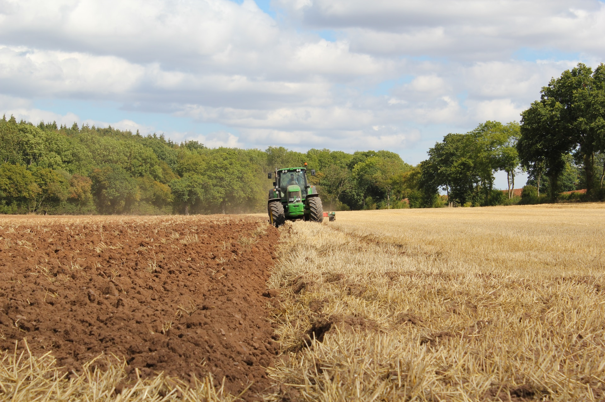

# Guinea pigs <!-- omit in toc -->

## Table of contents

- [Table of contents](#table-of-contents)
- [1. Why guinea pigs and markdown are awesome?](#1-why-guinea-pigs-and-markdown-are-awesome)
  - [1.1. How can I improve my markdown skills?](#11-how-can-i-improve-my-markdown-skills)
- [2. Why having a guinea pig is not an easy task. A list](#2-why-having-a-guinea-pig-is-not-an-easy-task-a-list)
- [3. How to format guinea pigs in markdown?](#3-how-to-format-guinea-pigs-in-markdown)
- [4. A photo without guinea pigs](#4-a-photo-without-guinea-pigs)
- [5. Pigs in a table](#5-pigs-in-a-table)
  
## 1. Why guinea pigs and markdown are awesome?

Guinea pigs have positive energy and are beautiful. That's why we're writing this document about them. Also, we're learning the beautiful art of markdown.

Guinea pigs often say:
> _Pigs are great. Humans too, when they have tasty snacks to give us._

### 1.1. How can I improve my markdown skills?

You can do it with pleasure by writing about guinea pigs. Let's go!

## 2. Why having a guinea pig is not an easy task. A list

Guinea pigs are very fragile animals and it's not always easy to notice their health problems from the very beginning.

What health issues can they have?

- Problems with teeth
- Problems with fur and skin
- Digestive issues
- Parasites
- Flu or runny nose
- Conjungtivitis

That's why it is always important to observe your guinea pigs and weigh them regularly! :)

What your guinea pig should always have?

1. Water and hay
2. Vegetables
3. Vitamin C

## 3. How to format guinea pigs in markdown?

Guinea pigs can be **bold**...

... or a bit _italic_...

they can be also...

1. tens
2. milions
3. or just a lot of them!

**Bold pigs are the best!**

## 4. A photo without guinea pigs

Maybe they hid somewhere?

## 5. Pigs in a table

| Guinea pig breed | Type of fur                         | Lifespan         |
| :---------------- | :-----------------------------------: | ----------------: |
| Peruvian         | long and silky, messy               | 4-7 years        |
| Alpaca           | short and thick                     | 4-7 years        |
| American         | short and silky                     | 4-7 years        |
| Sheltie          | short on the head, long on the body | 4-7 years        |

What's interesting, guinea pigs don't always function according to the math laws we normally know. A simple example is when they reproduce:

`1 + 1 = 3`

Saying that, it's worth remembering that two guinea pigs in one cage can result in more than just two pigs.

Want to read more about guinea pigs? [Wikipedia will give you lots of cool info!](https://pl.wikipedia.org/wiki/Kawia_domowa)

> Contact with guinea pigs can be addictive
