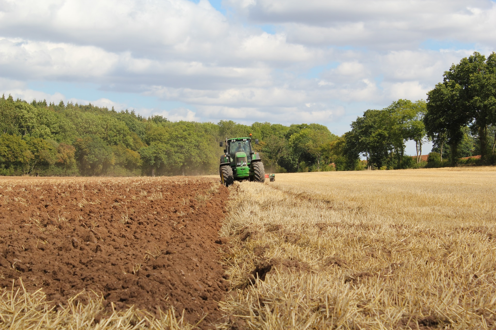

# Guinea pigs

## Chapter 1. Why guinea pigs are awesome

Guinea pigs have positive energy and are beautiful.

## Chapter 2. Why having a guinea pig is not an easy task

Guinea pigs are very fragile animals and it's not always easy to notice their health problems from the very beginning.

What health issues can they have?

* Problems with teeth
* Problems with fur and skin
* Digestive issues
* Parasites
* Flu or runny nose
* Conjungtivitis

That's why it is always important to observe your guinea pigs and weigh them regularly! :)

GUINEA-TEAM

## Chapter 3. How to highlight guinea pigs in markdown?

Guinea pigs can be **bold**...

... or a bit *wonky*...

they can be also...

1. tens
2. milions
3. or just a lot of them!

   **HELLO**

## Chapter 4. Pigs in a table

| Guinea pig breed | Type of fur                         |
| ---------------- | ----------------------------------- |
| Peruvian         | long and silky, messy               |
| Alpaca           | short and thick                     |
| American         | short and silky                     |
| Sheltie          | short on the head, long on the body |

- [Guinea pigs](#guinea-pigs)
  - [Chapter 1. Why guinea pigs are awesome](#chapter-1-why-guinea-pigs-are-awesome)
  - [Chapter 2. Why having a guinea pig is not an easy task](#chapter-2-why-having-a-guinea-pig-is-not-an-easy-task)
  - [Chapter 3. How to highlight guinea pigs in markdown?](#chapter-3-how-to-highlight-guinea-pigs-in-markdown)
  - [Chapter 4. Pigs in a table](#chapter-4-pigs-in-a-table)
